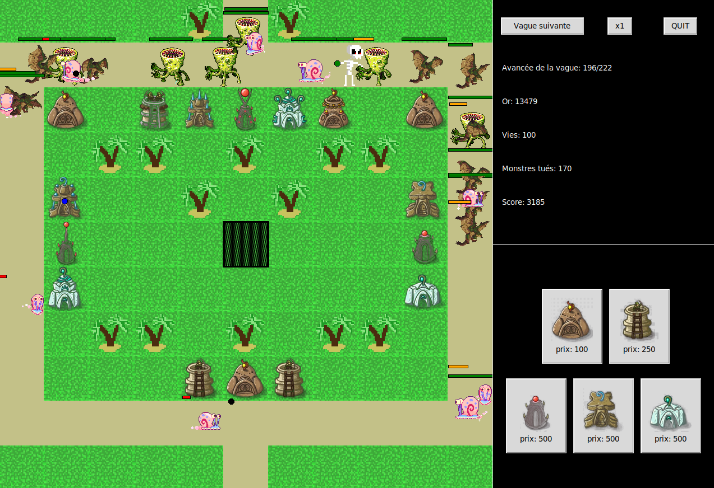

# Defender

Defender est un jeu de tower défense où le joueur doit placer des tourelles pour se protéger des ennemies qui avancent sur la carte.

Projet réalisé en **python** avec **tkinter** pour l'interface graphique.
Le projet est constitué d'un fichier principal *defender.py* et d'un second fichier python *gameplay.py* modifiable pour personnaliser le jeu.
Il est possible de personnaliser les vagues d'ennemies, d'en rajouter, de changer l'or gagné etc...

